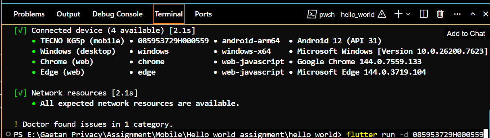

## Hello World Flutter App

This repository contains a simple Flutter “Hello World” application created as an assignment.  
It displays a centered **“Hello World”** message with a small footer text **“done by Gaetan”** at the bottom of the screen.

### Project Structure

- **Framework**: Flutter  
- **Language**: Dart  
- **Platforms**: Android (and other Flutter-supported platforms by default)

Key files:
- `lib/main.dart` – main application entry point and UI
- `pubspec.yaml` – project configuration and dependencies

### Requirements

- Flutter SDK installed  
- Android Studio / VS Code (or another IDE)  
- An Android device or emulator

### How to Run the App

1. **Clone the repository**
   ```bash
   git clone https://github.com/your-username/hello_world.git
   cd hello_world
   ```

2. **Get dependencies**
   ```bash
   flutter pub get
   ```

3. **Run on a connected device or emulator**
   ```bash
   flutter run
   ```

### Screenshots

Add your screenshots in this section:

- **Terminal command to start the app**

  

- **Running app on device**

  <!-- Replace `running_app.png` with your actual filename if different -->
  

### Notes

- This project is intended as a basic introduction to Flutter and Dart.
- It demonstrates a minimal UI layout using `Scaffold`, `Center`, and `Text` widgets, with a footer label.
